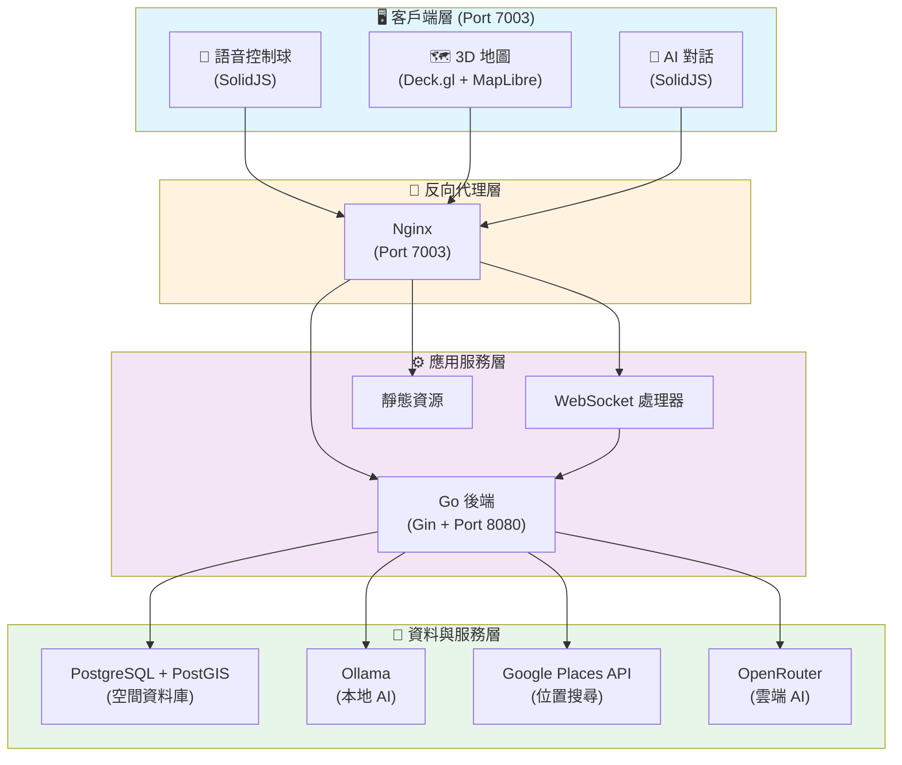
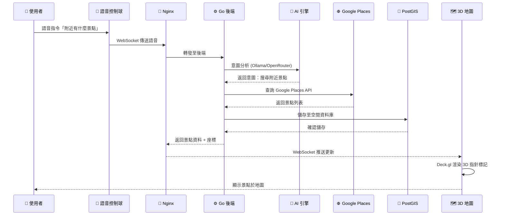

# 智慧空間平台 (Intelligent Spatial Platform)

[](https://golang.org/)
[](https://solidjs.com/)
[](https://deck.gl/)
[](LICENSE)
[](CONTRIBUTING.md)

> 個人開發的企業級地理空間平台，整合 AI 智能互動、語音控制與 3D 視覺化技術，提供智慧型位置服務解決方案。

---

## 目錄

- [專案概述](#專案概述)
- [核心功能](#核心功能)
- [系統架構](#系統架構)
- [快速開始](#快速開始)
  - [環境需求](#環境需求)
  - [安裝步驟](#安裝步驟)
  - [環境配置](#環境配置)
- [使用說明](#使用說明)
- [API 文檔](#api-文檔)
- [開發指南](#開發指南)
- [部署指南](#部署指南)
- [參與貢獻](#參與貢獻)
- [資訊安全](#資訊安全)
- [授權條款](#授權條款)
- [技術支援](#技術支援)

---

## 專案概述

**智慧空間平台**是一個**個人獨立開發**的生產等級地理空間應用系統，運用先進技術提供智慧型位置服務。採用 Go 與 SolidJS 開發，具備雙 AI 引擎（本地與雲端）、進階語音控制與精美的 3D 地圖視覺化功能。

> 💡 **開發背景**：本專案由一人從零開始設計、開發與維護，涵蓋前端、後端、資料庫、AI 整合、容器化部署等全棧技術。

### 平台特色

- **🤖 雙 AI 架構**：本地（Ollama）與雲端（OpenRouter）AI 處理無縫切換
- **🗣️ 進階語音控制**：自然語言指令與意圖識別
- **🌍 專業級 3D 地圖**：Deck.gl + MapLibre GL 搭配 ESRI 地形底圖
- **⚡ 即時通訊**：WebSocket 驅動的即時更新
- **🏢 企業就緒**：容器化部署，內建健康檢查與監控
- **🌐 生產驗證**：注重可擴展性與效能的設計

---

## 核心功能

### 主要能力

#### 🗺️ 地理空間視覺化
- **3D 地形渲染**：30° 傾斜視角搭配高品質 ESRI 底圖
- **即時位置追蹤**：亞秒級位置更新
- **互動式 3D 標記**：Google Maps 風格的立體指針標記
- **自訂圖層**：支援自訂資料圖層與視覺化

#### 🤖 AI 與自然語言處理
- **雙 AI 引擎**：
  - 本地：Ollama（Gemma 3 12B-IT）
  - 雲端：OpenRouter（Gemma 2 27B-IT）
- **語音識別**：雙系統架構（Chrome Web Speech + SpeechEar）
- **意圖分類**：支援搜尋、導航、描述、推薦等意圖
- **多語言支援**：繁體中文、英文、日文
- **速率限制**：內建 API 保護機制與可配置限制

#### 🌐 位置智慧服務
- **Google Places 整合**：台灣地區精準位置搜尋
- **地理編碼服務**：地址 ↔ 座標雙向轉換
- **鄰近搜尋**：尋找周邊景點設施
- **歷史景點資料庫**：精選文化地標與詳細描述

#### ⚡ 效能與可擴展性
- **WebSocket 協定**：全雙工即時通訊
- **RESTful API**：20+ 個文檔化端點
- **容器編排**：Podman Compose 多服務管理
- **熱重載**：開發模式即時程式碼重載
- **健康監控**：完整的健康檢查端點

### 技術規格

| 組件 | 技術 | 用途 |
|------|------|------|
| **後端** | Go 1.23 + Gin | 高效能 API 伺服器 |
| **前端** | SolidJS 1.8 | 響應式 UI 框架 |
| **資料庫** | PostgreSQL 16 + PostGIS | 空間資料儲存 |
| **3D 引擎** | Deck.gl + MapLibre GL | WebGL 地圖渲染 |
| **AI（本地）** | Ollama | 隱私優先的本地推論 |
| **AI（雲端）** | OpenRouter | 可擴展的雲端 AI |
| **容器** | Podman | 安全容器化 |
| **反向代理** | Nginx | 生產級路由 |

---

## 系統架構

### 架構概覽



### 資料流程



### 核心技術棧

| 層級 | 技術 | 用途 |
|------|------|------|
| **前端** | SolidJS 1.8 | 響應式 UI 框架 |
| **3D 引擎** | Deck.gl + MapLibre GL | WebGL 地圖渲染 |
| **後端** | Go 1.23 + Gin | 高效能 API 伺服器 |
| **資料庫** | PostgreSQL 16 + PostGIS | 空間資料儲存 |
| **AI（本地）** | Ollama (Gemma 3 12B) | 隱私優先的本地推論 |
| **AI（雲端）** | OpenRouter (Gemma 2 27B) | 可擴展的雲端 AI |
| **容器** | Podman + Compose | 安全容器化部署 |
| **代理** | Nginx | 生產級反向代理 |

---

## 快速開始

### 環境需求

**必要項目：**
- [Podman](https://podman.io/) 4.0 或更新版本
- [Podman Compose](https://github.com/containers/podman-compose) 1.0+
- [Make](https://www.gnu.org/software/make/)（通常已預裝）

**選用項目（本機開發）：**
- [Go](https://golang.org/) 1.23+
- [Node.js](https://nodejs.org/) 20+
- [Ollama](https://ollama.ai/)（本地 AI 使用）

### 安裝步驟

```bash
# 複製專案
git clone https://github.com/yes1688/smartmap-platform.git
cd smartmap-platform

# 複製環境變數範本
cp .env.example .env

# 編輯 .env 填入您的 API Keys
# 必填：GOOGLE_PLACES_API_KEY、OPENROUTER_API_KEY（如使用雲端 AI）
nano .env

# 啟動平台（擇一）
make dev    # 開發模式（支援熱重載）
make prod   # 生產模式（最佳化建置）
```

### 環境配置

#### 環境變數設定

在專案根目錄建立 `.env` 檔案：

```bash
# AI 提供者選擇
AI_PROVIDER=openrouter              # 選項：ollama | openrouter

# Google 服務
GOOGLE_PLACES_API_KEY=您的金鑰      # 位置搜尋必填

# 雲端 AI (OpenRouter)
OPENROUTER_API_KEY=您的金鑰         # AI_PROVIDER=openrouter 時必填
OPENROUTER_MODEL=google/gemma-2-27b-it:free

# 本地 AI (Ollama)
OLLAMA_URL=http://localhost:11434
OLLAMA_MODEL=gemma3:12b-it-qat

# 資料庫
DB_PASSWORD=您的安全密碼             # 請更改預設值

# 安全性
JWT_SECRET=您的JWT密鑰              # 請生成安全密鑰
```

**⚠️ 安全提醒**：請勿將 `.env` 檔案提交至版本控制系統。請使用 `.env.example` 作為範本。

#### 取得 API 金鑰

1. **Google Places API**：
   - 前往 [Google Cloud Console](https://console.cloud.google.com/)
   - 建立專案並啟用「Places API (Text Search)」
   - 產生 API 金鑰
   - 建議：設定 IP 或網域限制

2. **OpenRouter API**（雲端 AI 使用）：
   - 前往 [OpenRouter](https://openrouter.ai/keys)
   - 註冊並產生 API 金鑰
   - 免費方案：每分鐘 1 次請求

---

## 使用說明

### 存取平台

啟動後，開啟瀏覽器前往：

```
http://localhost:7003
```

所有服務（開發與生產環境）統一使用 **7003** 埠號。

### 語音指令

平台支援自然語言語音指令：

**導航指令**
```
「移動到台北101」
「Go to Taipei 101」
「帶我去高雄」
```

**搜尋指令**
```
「附近有什麼景點」
「搜尋附近的餐廳」
「找找看博物館」
```

**資訊查詢**
```
「介紹這個地方」
「告訴我關於這個位置」
「這裡有什麼歷史」
```

### API 使用範例

**健康檢查**
```bash
curl http://localhost:7003/health
```

**AI 對話**
```bash
curl -X POST http://localhost:7003/api/v1/ai/chat \
  -H "Content-Type: application/json" \
  -d '{"message":"介紹台北101","playerId":"user123"}'
```

**位置搜尋**
```bash
curl -X POST http://localhost:7003/api/v1/places/search \
  -H "Content-Type: application/json" \
  -d '{"query":"台北101"}'
```

**玩家狀態**
```bash
curl "http://localhost:7003/api/v1/game/status?playerId=user123"
```

完整 API 文檔請參閱 [API.md](docs/API.md)。

---

## API 文檔

平台提供完整的 RESTful API。詳細文檔請見：

📖 **[API 參考文件](docs/API.md)**

### 快速參考

| 端點 | 方法 | 說明 |
|------|------|------|
| `/health` | GET | 健康檢查 |
| `/api/v1/ai/chat` | POST | AI 對話 |
| `/api/v1/places/search` | POST | Google Places 搜尋 |
| `/api/v1/game/status` | GET | 玩家遊戲狀態 |
| `/api/v1/game/move` | POST | 移動玩家位置 |
| `/ws` | WebSocket | 即時更新 |

**速率限制**：大部分 AI 與外部 API 端點已啟用速率限制。詳見 [API.md](docs/API.md)。

---

## 開發指南

### 專案結構

```
smartmap-platform/
├── cmd/                    # 應用程式進入點
│   └── server/            # 主伺服器應用程式
├── internal/              # 私有應用程式碼
│   ├── ai/               # AI 服務（Ollama + OpenRouter）
│   ├── game/             # 遊戲邏輯與狀態
│   ├── geo/              # 地理空間服務
│   ├── handlers/         # HTTP 處理器（5 個模組）
│   ├── middleware/       # HTTP 中介軟體
│   └── voice/            # 語音處理
├── web/                   # 前端應用程式
│   └── src/
│       ├── components/   # SolidJS 組件
│       │   ├── ai/      # AI 相關 UI
│       │   ├── map/     # 地圖視覺化
│       │   ├── game/    # 遊戲 UI
│       │   └── layout/  # 版面配置組件
│       └── stores/      # 狀態管理
├── configs/              # 配置檔案
├── containers/           # 容器配置
├── docs/                 # 文檔
└── Makefile             # 建置自動化
```

### 可用指令

```bash
# 開發環境
make dev              # 啟動開發環境
make dev-logs         # 查看開發日誌
make dev-down         # 停止開發環境
make dev-restart      # 重啟開發服務

# 生產環境
make prod             # 啟動生產環境
make prod-logs        # 查看生產日誌
make prod-down        # 停止生產環境

# 工具指令
make status           # 檢查容器狀態
make clean            # 清理容器與資料卷（⚠️ 破壞性操作）
make help             # 顯示所有可用指令
```

### 執行測試

```bash
# 後端測試
podman exec spatial-backend-dev go test ./internal/... -v -cover

# 目前測試覆蓋率：23%（持續改進中）
```

### 開發工作流程

1. **啟動開發環境**
   ```bash
   make dev
   ```

2. **進行修改**
   - 後端：儲存時自動重載
   - 前端：Vite HMR 即時更新

3. **執行測試**
   ```bash
   podman exec spatial-app go test ./internal/... -v
   ```

4. **生產環境驗證**
   ```bash
   make dev-down
   make prod
   # 測試生產版本
   ```

5. **提交變更**
   ```bash
   git add .
   git commit -m "feat: 您的功能描述"
   git push origin master
   ```

---

## 部署指南

### 容器化部署（建議）

本平台設計為使用 Podman Compose 進行容器化部署。

**生產環境部署：**

```bash
# 1. 複製並配置
git clone https://github.com/yes1688/smartmap-platform.git
cd smartmap-platform
cp .env.example .env
# 編輯 .env 填入生產環境數值

# 2. 建置並啟動
make prod

# 3. 驗證健康狀態
curl http://localhost:7003/health
```

**環境特定配置：**

- **開發環境**：`podman-compose.dev.yml`（熱重載、除錯日誌）
- **生產環境**：`podman-compose.yml`（最佳化建置、發布模式）

### 多階段建置流程

生產建置採用多階段 Docker 建置以獲得最佳映像檔大小：

1. **後端建置器**：編譯 Go 二進位檔
2. **前端建置器**：建置 SolidJS 應用程式
3. **執行環境**：極簡 Alpine 基礎映像檔
4. **Nginx**：提供靜態資源與 API 代理

**最終映像檔大小：**
- 後端：~50MB（Alpine + Go 二進位檔）
- 前端：~30MB（Alpine + Nginx + 靜態檔案）

### 健康檢查

所有服務皆包含健康檢查配置：

```yaml
healthcheck:
  test: ["CMD", "curl", "-f", "http://localhost:8080/health"]
  interval: 15s
  timeout: 5s
  retries: 3
```

### 擴展考量

- **資料庫**：PostgreSQL 連線池（最大 100 個連線）
- **API**：無狀態後端允許水平擴展
- **WebSocket**：負載平衡時考慮 sticky sessions
- **AI**：Ollama 可使用 GPU 加速（如可用）

---

## 參與貢獻

我們歡迎社群貢獻！詳情請參閱[貢獻指南](CONTRIBUTING.md)。

### 如何貢獻

1. Fork 本專案
2. 建立功能分支（`git checkout -b feature/amazing-feature`）
3. 提交您的變更（`git commit -m 'feat: 新增絕佳功能'`）
4. 推送至分支（`git push origin feature/amazing-feature`）
5. 開啟 Pull Request

### 提交規範

我們遵循 [Conventional Commits](https://www.conventionalcommits.org/)：

```
feat: 新增語音指令
fix: 修正地圖渲染問題
docs: 更新 API 文檔
refactor: 最佳化 AI 服務
test: 新增地理服務單元測試
```

### 開發哲學

本專案遵循 **Linus Torvalds 的實用主義方法**：

> 「廢話少說，直接看程式碼。」

- **功能優先**：先讓它運作，再讓它美觀
- **簡潔性**：避免不必要的抽象
- **漸進式改進**：小步快跑的工作迭代
- **效能至上**：不接受效能倒退

詳見 [CLAUDE.md](CLAUDE.md) 的詳細開發指南。

---

## 資訊安全

### 回報安全問題

請將安全漏洞回報至：**[security@your-domain.com]**

**請勿**針對安全性錯誤開啟公開 issue。

### 安全最佳實踐

✅ **已實作：**
- 基於環境變數的配置（無硬編碼密鑰）
- `.gitignore` 保護敏感檔案
- API 速率限制以防濫用
- 生產部署的 CORS 配置
- 監控用健康檢查端點

⚠️ **建議事項：**
- 每 3-6 個月輪換 API 金鑰
- 在 Google Places API 設定 IP/網域限制
- 使用強 JWT 密鑰（32+ 字元）
- 生產環境啟用 HTTPS
- 監控 API 使用量並設定告警

### 安全稽核

最近安全稽核：**2025-10-07**
- ✅ Git 歷史中無 API 金鑰
- ✅ 公開儲存庫中無敏感資料
- ✅ 所有密鑰使用環境變數
- ✅ `.env` 檔案已正確忽略

---

## 授權條款

本專案採用 **MIT 授權條款** - 詳見 [LICENSE](LICENSE) 檔案。

```
MIT License

Copyright (c) 2025 智慧空間平台貢獻者

Permission is hereby granted, free of charge, to any person obtaining a copy
of this software and associated documentation files...
```

---

## 技術支援

### 文檔資源

- 📖 **[開發指南](docs/DEVELOPMENT.md)** - 完整開發工作流程
- 📖 **[API 參考](docs/API.md)** - REST API 與 WebSocket 規格
- 📖 **[疑難排解](docs/TROUBLESHOOTING.md)** - 常見問題與解決方案
- 📖 **[架構分析](docs/reports/ARCHITECTURE_ANALYSIS.md)** - 系統架構詳細說明

### 取得協助

- 🐛 **錯誤回報**：[GitHub Issues](https://github.com/yes1688/smartmap-platform/issues)
- 💬 **討論區**：[GitHub Discussions](https://github.com/yes1688/smartmap-platform/discussions)
- 📧 **電子郵件**：[support@your-domain.com]

### 專案統計

- **程式碼行數**：~12,500+
  - 後端（Go）：3,000+
  - 前端（TypeScript/TSX）：9,500+
  - 測試：370+
- **API 端點**：20+
- **組件數**：30+ SolidJS 組件
- **測試覆蓋率**：23%（改進中）
- **文檔**：5,000+ 行

### 致謝

使用以下優秀的開源專案建置：

- [Go](https://golang.org/) - 後端語言
- [SolidJS](https://solidjs.com/) - 前端框架
- [Deck.gl](https://deck.gl/) - WebGL 視覺化
- [MapLibre GL](https://maplibre.org/) - 地圖渲染
- [PostgreSQL](https://www.postgresql.org/) - 資料庫
- [Ollama](https://ollama.ai/) - 本地 AI 推論
- [OpenRouter](https://openrouter.ai/) - 雲端 AI 平台

---

<div align="center">

**用 ❤️ 為地理空間社群打造**

[⭐ 給專案星星](https://github.com/yes1688/smartmap-platform) | [🐛 回報錯誤](https://github.com/yes1688/smartmap-platform/issues) | [✨ 功能建議](https://github.com/yes1688/smartmap-platform/issues)

</div>
