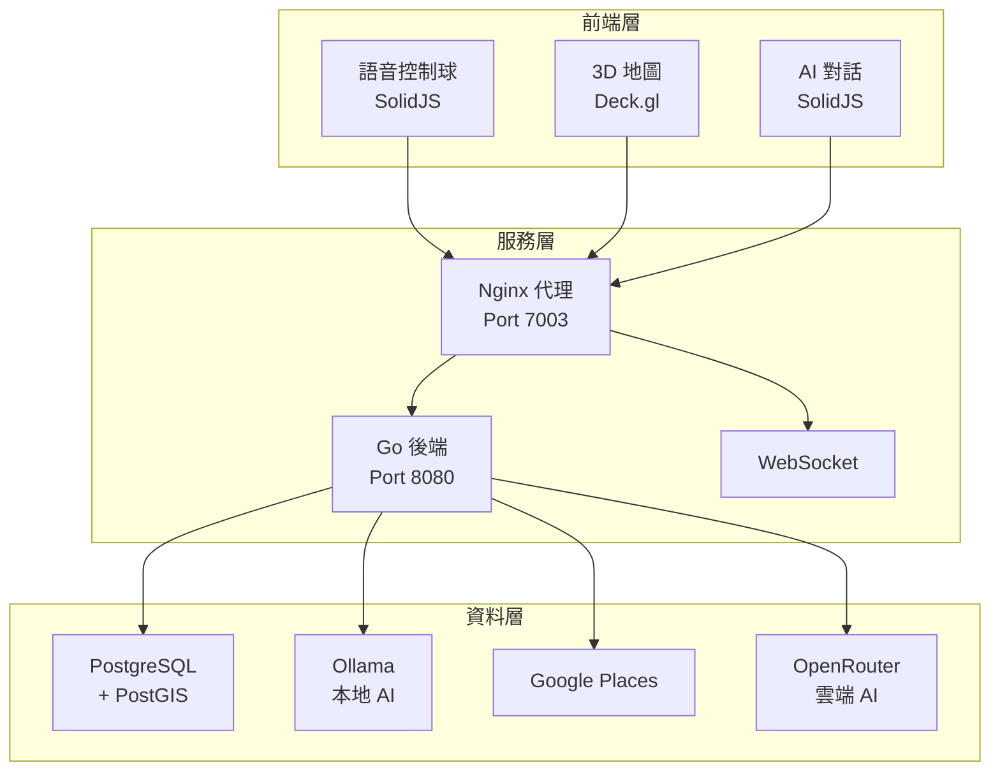
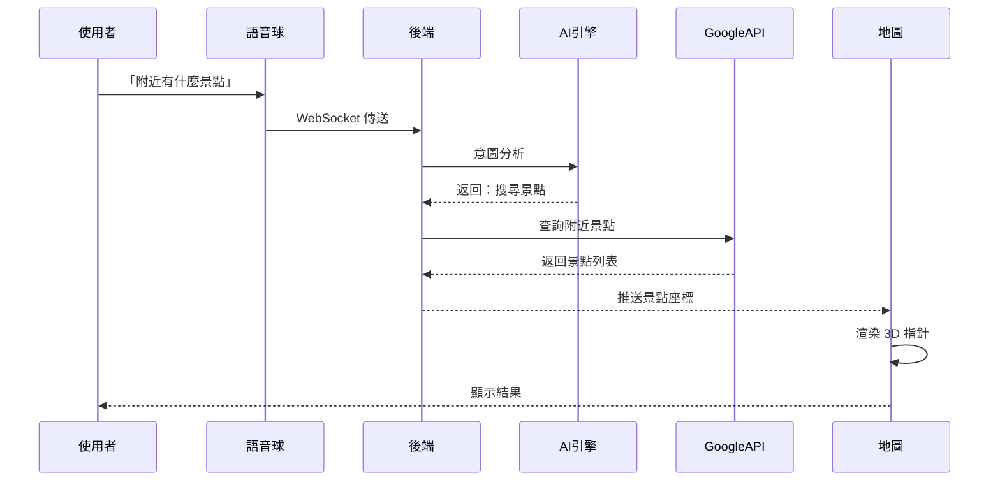

# 智慧空間平台 (Intelligent Spatial Platform)

[](https://golang.org/)
[](https://solidjs.com/)
[](https://deck.gl/)
[](LICENSE)

> 結合 AI 對話、語音控制與 3D 地圖的地理空間應用平台

**專案特點**：全棧獨立開發 | 雙 AI 引擎架構 | 完整容器化部署

---

## 快速預覽

```bash
git clone https://github.com/yes1688/smartmap-platform.git
cd smartmap-platform
cp .env.example .env
# 編輯 .env 填入 API Keys
make prod
# 訪問 http://localhost:7003
```

**語音指令示範**：「附近有什麼景點」→ 地圖顯示 3D 立體指針標記

---

## 專案說明

這是一個整合多種技術的地理空間應用平台，主要功能包括：

- **語音控制**：自然語言指令操作地圖（支援中文、英文、日文）
- **AI 對話**：整合本地 AI（Ollama）與雲端 AI（OpenRouter）
- **3D 地圖**：Deck.gl + MapLibre GL 渲染，支援 30° 傾斜視角
- **位置搜尋**：Google Places API 整合，台灣地區精準搜尋
- **即時通訊**：WebSocket 實現即時位置更新

---

## 技術架構

### 系統架構圖



### 資料流程



---

## 技術棧

**後端**
- Go 1.23 + Gin Framework
- PostgreSQL 16 + PostGIS（空間資料）
- WebSocket（即時通訊）

**前端**
- SolidJS 1.8（響應式框架）
- Deck.gl + MapLibre GL（3D 地圖）
- TailwindCSS（樣式）

**AI 整合**
- Ollama（本地 AI，Gemma 3 12B-IT）
- OpenRouter（雲端 AI，Gemma 2 27B-IT）
- 支援動態切換

**DevOps**
- Podman + Podman Compose（容器化）
- Nginx（反向代理）
- 多階段建置（最佳化映像檔大小）

---

## 功能展示

### 1. 語音控制

```
「移動到台北101」      → AI 解析 → 地圖移動至座標
「附近有什麼景點」      → 搜尋 → 顯示 3D 標記
「介紹這個地方」        → AI 生成描述
```

### 2. 3D 地圖標記

- 使用 Deck.gl `ColumnLayer` 建立立體指針
- Google Maps 風格紅色標記（#EA4335）
- 高度 30 米，帶地面陰影
- 支援點擊互動與 Hover 高亮

### 3. AI 雙引擎

| 引擎 | 模型 | 用途 |
|------|------|------|
| Ollama | Gemma 3 12B-IT | 本地推論，隱私優先 |
| OpenRouter | Gemma 2 27B-IT | 雲端推論，效能優先 |

可透過環境變數切換：`AI_PROVIDER=ollama` 或 `openrouter`

---

## 安裝與執行

### 環境需求

- Podman 4.0+（容器引擎）
- Make（建置工具）
- API Keys：
  - Google Places API（必填）
  - OpenRouter API（選填，使用雲端 AI 時）

### 快速啟動

```bash
# 1. 複製專案
git clone https://github.com/yes1688/smartmap-platform.git
cd smartmap-platform

# 2. 配置環境變數
cp .env.example .env
nano .env  # 填入 GOOGLE_PLACES_API_KEY 等

# 3. 啟動（擇一）
make dev   # 開發模式（熱重載）
make prod  # 生產模式（最佳化）

# 4. 訪問
open http://localhost:7003
```

### 環境變數說明

```bash
# AI 選擇
AI_PROVIDER=openrouter              # ollama 或 openrouter

# Google API
GOOGLE_PLACES_API_KEY=your_key      # 位置搜尋用

# 雲端 AI (選填)
OPENROUTER_API_KEY=your_key         # 使用 OpenRouter 時需要

# 資料庫
DB_PASSWORD=your_password           # 建議更改預設值
```

---

## API 文檔

### RESTful API

| 端點 | 方法 | 說明 |
|------|------|------|
| `/health` | GET | 健康檢查 |
| `/api/v1/ai/chat` | POST | AI 對話 |
| `/api/v1/places/search` | POST | 搜尋地點 |
| `/api/v1/game/status` | GET | 玩家狀態 |
| `/api/v1/game/move` | POST | 移動位置 |

### WebSocket

```javascript
// 連線
ws://localhost:7003/ws

// 語音指令
{
  "type": "voice_command",
  "data": { "command": "附近有什麼景點" }
}

// 位置更新
{
  "type": "player_move",
  "data": { "lat": 25.0330, "lng": 121.5654 }
}
```

詳細文檔：[docs/API.md](docs/API.md)

---

## 專案結構

```
smartmap-platform/
├── cmd/server/              # Go 主程式
├── internal/                # 後端邏輯
│   ├── ai/                 # AI 服務
│   ├── game/               # 遊戲邏輯
│   ├── geo/                # 地理服務
│   ├── handlers/           # HTTP 處理器
│   └── voice/              # 語音處理
├── web/                     # 前端應用
│   └── src/
│       ├── components/     # SolidJS 組件
│       │   ├── ai/        # AI 相關
│       │   ├── map/       # 地圖組件
│       │   └── layout/    # 版面配置
│       └── stores/        # 狀態管理
├── configs/                 # 配置檔
├── containers/              # 容器設定
└── docs/                    # 文檔
```

---

## 開發指令

```bash
# 開發環境
make dev              # 啟動（支援熱重載）
make dev-logs         # 查看日誌
make dev-down         # 停止
make dev-restart      # 重啟

# 生產環境
make prod             # 啟動（最佳化建置）
make prod-logs        # 查看日誌
make prod-down        # 停止

# 測試
podman exec spatial-app go test ./internal/... -v -cover

# 狀態檢查
make status           # 查看容器狀態
```

---

## 技術亮點

### 1. 模組化架構

- 後端 API 處理器分為 5 個模組（handlers_*.go）
- 前端組件按功能分類（ai/, map/, game/, layout/）
- 清晰的職責分離

### 2. 容器化部署

- 多階段 Docker 建置
- 後端映像檔：~50MB（Alpine + Go binary）
- 前端映像檔：~30MB（Alpine + Nginx + 靜態檔案）
- 健康檢查與自動重啟

### 3. 效能最佳化

- WebSocket 即時通訊（低延遲）
- Vite HMR 熱模組替換（開發效率）
- API 速率限制（防濫用）
- 資料庫連線池（最大 100 連線）

### 4. 安全性

- 環境變數管理敏感資訊
- `.gitignore` 保護機密檔案
- CORS 配置
- 定期安全稽核（最近：2025-10-07）

---

## 開發歷程

**程式碼統計**
- 後端（Go）：~3,000 行
- 前端（TypeScript/TSX）：~9,500 行
- 測試：~370 行
- 文檔：~5,000 行

**開發時程**
- 架構設計與技術選型
- 後端 API 開發與模組化重構
- 前端 UI 與 3D 地圖整合
- AI 引擎整合（Ollama + OpenRouter）
- 語音控制系統實作
- 容器化部署與 CI/CD
- 測試與文檔撰寫

**測試覆蓋率**：23%（持續改進中）

---

## 技術棧總覽

| 技術 | 版本 | 用途 |
|------|------|------|
| Go | 1.23 | 後端語言 |
| Gin | Latest | Web 框架 |
| SolidJS | 1.8 | 前端框架 |
| Deck.gl | Latest | 3D 視覺化 |
| MapLibre GL | Latest | 地圖引擎 |
| PostgreSQL | 16 | 關聯式資料庫 |
| PostGIS | 3.4 | 空間擴充功能 |
| Ollama | Latest | 本地 AI |
| OpenRouter | API | 雲端 AI |
| Podman | 4.9+ | 容器引擎 |
| Nginx | Alpine | 反向代理 |

---

## 相關文檔

- 📖 [開發指南](docs/DEVELOPMENT.md) - 完整開發流程
- 📖 [API 文檔](docs/API.md) - RESTful API 規格
- 📖 [疑難排解](docs/TROUBLESHOOTING.md) - 常見問題
- 📖 [架構分析](docs/reports/ARCHITECTURE_ANALYSIS.md) - 技術細節

---

## 授權

MIT License - 詳見 [LICENSE](LICENSE)

## 聯絡

- GitHub: [@yes1688](https://github.com/yes1688)
- Issues: [回報問題](https://github.com/yes1688/smartmap-platform/issues)

---

*2025*
